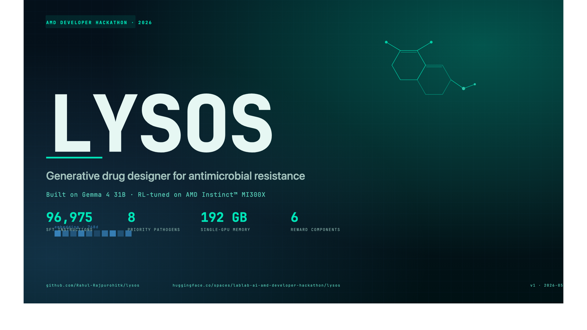
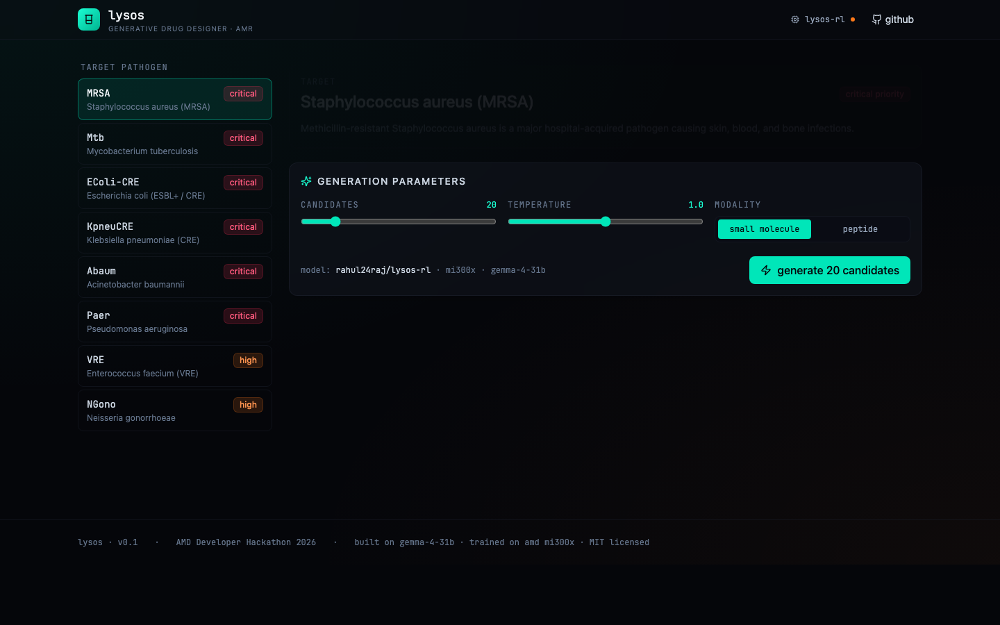
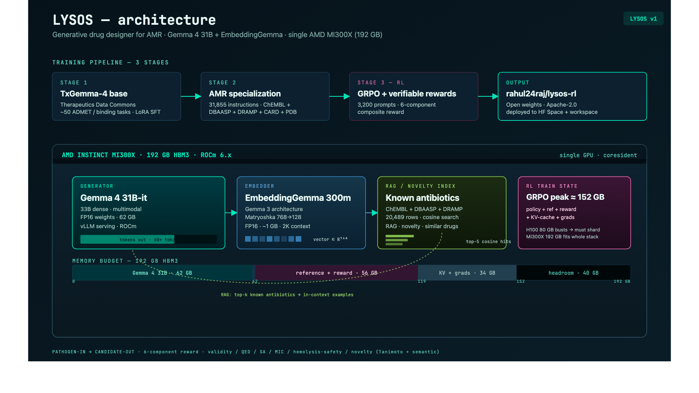
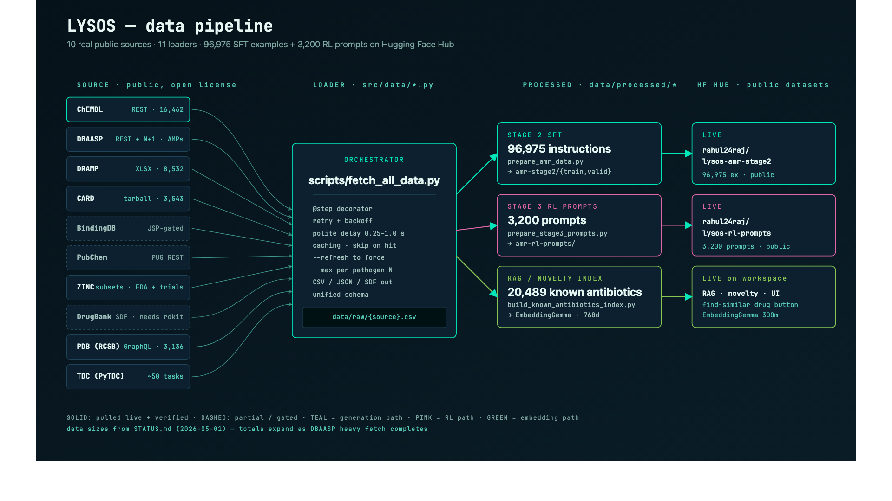

# Lysos



> **An open-source generative drug designer built on Gemma 4, specialized for designing novel antibiotics against drug-resistant bacteria, trained with reinforcement learning on AMD MI300X.**

[]()
[]()
[]()

---

## Why Lysos exists

**Antimicrobial resistance is the silent pandemic.**

- 1.27 million deaths every year, today (WHO)
- Projected to reach 10 million per year by 2050 (UN)
- Routine surgery, childbirth, and hospital stays become deadly without working antibiotics
- The pharmaceutical industry has largely abandoned antibiotic R&D — too expensive, too slow, too low-margin

**We need a new tool.** Lysos generates novel antibacterial molecules against resistant pathogens in seconds, on a single GPU, with publicly verifiable activity scores. It's open-source, built on the latest Gemma 4 frontier model, trained with reinforcement learning for accuracy and novelty, deployed on AMD MI300X — the only single-GPU platform with enough memory to run the full training and inference pipeline coresident.

---

## What Lysos does

```
        Target pathogen / protein
                │
                ▼
   ┌──────────────────────────────┐
   │  Lysos generative model      │
   │  (Gemma 4 + RL on MI300X)    │
   └──────────────┬───────────────┘
                  ▼
       50-100 candidate molecules
                  │
                  ▼
   ┌──────────────────────────────┐
   │  Multi-objective scoring     │
   │  • predicted MIC             │
   │  • drug-likeness (QED)       │
   │  • synthesizability (SA)     │
   │  • hemolysis / safety        │
   │  • novelty vs known abx      │
   └──────────────┬───────────────┘
                  ▼
       Ranked candidates with 3D viz
```

Input a resistant pathogen (e.g., MRSA, M. tuberculosis, gram-negative ESKAPE pathogens). Get back novel, scored, downloadable molecule candidates ranked by predicted antibacterial activity, safety, synthesizability, and novelty.



---

## Architecture

Three-stage training pipeline + two-model coresident inference, all on a single AMD Instinct MI300X:

| Stage | Goal | Hardware | Output |
|---|---|---|---|
| **1. TxGemma-4** | Build a chemistry-aware Gemma 4 base by replicating Google's TxGemma recipe on Therapeutics Data Commons (~50 tasks) | Large 8× MI300X | Open-source foundation model |
| **2. AMR specialization** | Fine-tune TxGemma-4 on antibiotic-specific data (ChEMBL, DBAASP, DRAMP, DrugBank, CARD, PDB) — 222,606 instruction examples | Small 1× MI300X | AMR-specialized SFT model |
| **3. RL with verifiable rewards** | GRPO training with multi-objective rewards (activity + safety + novelty + semantic novelty) | Small 1× MI300X | Final Lysos generator |

Two Gemma-family models coresident at inference:
- **Gemma 4 31B-it** — generator (62 GB FP16)
- **EmbeddingGemma 300m** — retrieval, RAG, semantic novelty reward, similar-drug lookup (1 GB)

Why MI300X specifically: GRPO training holds policy + reference + reward predictor coresident in memory (~150 GB), which exceeds H100 80GB. The 192 GB MI300X is the prerequisite, not optional.



---

## Repo structure

```
lysos/
├── src/
│   ├── training/      # Stage 1, 2, 3 training scripts
│   ├── inference/     # Generation + scoring runtime
│   ├── data/          # Dataset preparation
│   └── eval/          # Benchmark harnesses
├── workspace/         # Vite + React + FastAPI demo (HF Space-deployable)
├── notebooks/         # Exploration + analysis
├── scripts/           # Utility scripts
├── docker/            # Containerization
└── docs/              # Tech spec + ADRs
```

---

## Status

🚧 **In active development for the AMD Developer Hackathon (May 4-10, 2026)**

This repo is currently private; will be public-source by submission. Watch this space.

### Reserved deployments

| Resource | URL | State |
|---|---|---|
| **GitHub repo** | https://github.com/Rahul-Rajpurohitk/lysos | private until kickoff |
| **HF Space (demo)** | https://huggingface.co/spaces/lablab-ai-amd-developer-hackathon/lysos | reserved |
| **HF Model — TxGemma-4 (Stage 1)** | https://huggingface.co/rahul24raj/txgemma-4-31b | reserved |
| **HF Model — Lysos base (Stage 2 SFT)** | https://huggingface.co/rahul24raj/lysos-base | reserved |
| **HF Model — Lysos RL (final)** | https://huggingface.co/rahul24raj/lysos-rl | reserved |
| **HF Dataset — Stage 2 AMR** | https://huggingface.co/datasets/rahul24raj/lysos-amr-stage2 | **LIVE — 222,606 examples** |
| **HF Dataset — Stage 3 RL prompts** | https://huggingface.co/datasets/rahul24raj/lysos-rl-prompts | **LIVE — 3,200 prompts** |

---

## Authors

- [Rahul Rajpurohit](https://github.com/Rahul-Rajpurohitk)

---

## License

MIT — see [LICENSE](./LICENSE)

---

## Data sources (10 real loaders, all open license)

| Source | Loader | What | Typical size |
|---|---|---|---|
| **TDC** | `scripts/prepare_tdc_data.py` | Therapeutics Data Commons (~50 ADMET, binding, tox tasks) | ~500 MB |
| **ChEMBL** | `src/data/chembl.py` | ChEMBL REST API — bacterial activity (MIC, MBC, IC50, Ki) | ~30 MB |
| **DBAASP** | `src/data/dbaasp.py` | DBAASP — antimicrobial peptides + per-strain MIC + hemolysis | ~5 MB |
| **APD3** | `src/data/apd3.py` | Antimicrobial Peptide DB (curated AMPs) | ~1 MB |
| **DRAMP** | `src/data/dramp.py` | Data Repository of Antimicrobial Peptides (~22K peptides) | ~10 MB |
| **CARD** | `src/data/card.py` | Comprehensive Antibiotic Resistance Database | ~10 MB |
| **BindingDB** | `src/data/bindingdb.py` | Binding affinities (Ki/Kd/IC50/EC50) — bacterial subset streamed from full TSV | ~200 MB |
| **PubChem** | `src/data/pubchem.py` | Curated antibacterial bioassays via PUG REST | ~50-500 MB |
| **ZINC** | `src/data/zinc.py` | FDA-approved + investigational + world drug-like SMILES | ~50 MB |
| **DrugBank** | `src/data/drugbank.py` | DrugBank Open Data (free-tier; SMILES + indications) | ~5 MB |
| **PDB** | `src/data/pdb.py` | RCSB metadata for AMR pathogen target structures | ~5 MB |

Run all of them at once with:

```bash
python scripts/fetch_all_data.py --max-per-pathogen 2000
```

After fetching, see what's on disk:

```bash
python scripts/data_inventory.py
```



## Quickstart

```bash
# 1. Clone + install
git clone https://github.com/Rahul-Rajpurohitk/lysos.git
cd lysos
pip install -e .

# 2. Verify everything imports cleanly (24 modules)
make verify

# 3. Run the unit tests
make test

# 4. Pull a small slice of real data (cap 200/pathogen)
make fetch

# 5. Build the workspace frontend
make web-install web-build

# 6. Run the local FastAPI server (after pushing models to HF)
make api-dev
```

## Documents

- `docs/tech-spec.md` — locked technical specification (architecture, training stages, reward stack)
- `docs/data-pipeline.md` — end-to-end data flow (sources → loaders → processed → HF Hub)
- `docs/pitch-deck.md` — 10-slide submission deck (problem, solution, demo, architecture, business, ask)
- `docs/demo-video-storyboard.md` — beat-by-beat 5-min MP4 plan with on-screen + voiceover
- `docs/build-in-public.md` — pre-written social posts, day -3 through submission day
- `docs/ROADMAP.md` — pre-kickoff checklist
- `STATUS.md` — single-page snapshot of where the project stands today
- `examples/` — minimal scripts: quickstart, score-one-smiles, find-similar-drugs
- `model_cards/` — Hugging Face model + dataset cards (pushed to HF Hub at submission)
- `vault/` — research notes, ADRs, session logs (Obsidian-style)

## Acknowledgments

- Generation: [Gemma 4 31B-it](https://huggingface.co/google/gemma-4-31B-it) (Google)
- Embeddings + RAG: [EmbeddingGemma 300m](https://huggingface.co/google/embeddinggemma-300m) (Google)
- Inspired by [TxGemma](https://huggingface.co/collections/google/txgemma-release-67dd92e931c857d15e4d1e87) (Google)
- Compute by [AMD Developer Cloud](https://www.amd.com/en/developer/resources/cloud-access/amd-developer-cloud.html) on AMD Instinct™ MI300X
- Submitted to: [AMD Developer Hackathon](https://lablab.ai/ai-hackathons/amd-developer) by [lablab.ai](https://lablab.ai)
